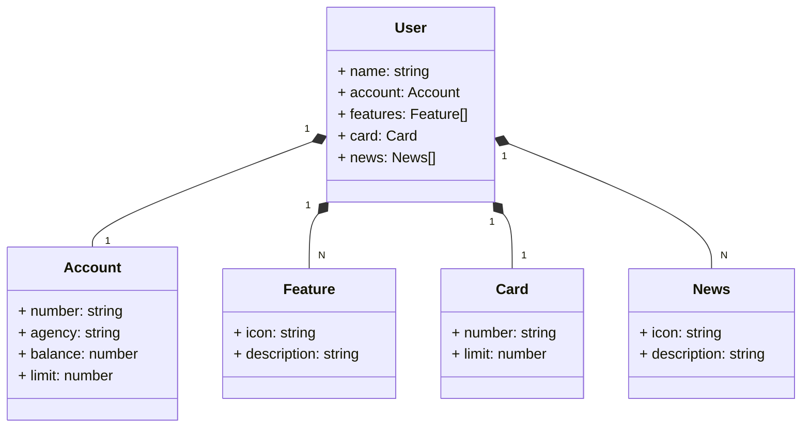

[](https://github.com/lucarauj/Santander-Dev-Week/blob/main/LICENSE)

# Santander Dev Week - APIs com Java 17 e Spring Boot 3

<br>

## Start do projeto base:

- https://start.spring.io/

<br>

## Dependências:

- Spring Web
- Spring Data JPA
- H2 Database
- PostgreSQL Driver
- Lombok

<br>

## Objetos da minha aplicação no formato JSON:

```
{
	"name": "Lucas",
	"account": {
		"number": "00000000-0",
		"agency": "0000",
		"balance": 1234.56,
		"limit": 1000.00
	},
	"features": [
		{
			"icon": "URL",
			"description": "Descrição"
		}
	],
	"card": {
		"number": "xxx xxx xxx 000",
		"limit": 1000.00
	},
	"news": [
		{
			"icon": "URL",
			"description": "Descrição"
		}
	]
}
```

<br>

## Gerando diagrama de classe Mermaid com chatGPT utilizando JSON:



<br>

## Anotações:

- @Entity
- @Id
- @GeneratedValue(strategy = GenerationType.IDENTITY)
- @OneToOne(cascade = CascadeType.ALL)
- @OneToMany(cascade = CascadeType.ALL, fetch = FetchType.EAGER)
- @Column(unique = true)
- @Column(name = "additional_limit", scale = 2, precision = 13)
- @MappedSuperclass
- @Getter
- @Setter
- @Service
- @RestController
- @RequestMapping
- @GetMapping
- @PostMapping
- @PathVariable
- @RestControllerAdvice
- @ExceptionHandler

<br>

## 👨‍🎓 Autor

#### Lucas Araujo

<a href="https://www.linkedin.com/in/lucarauj"></a>
