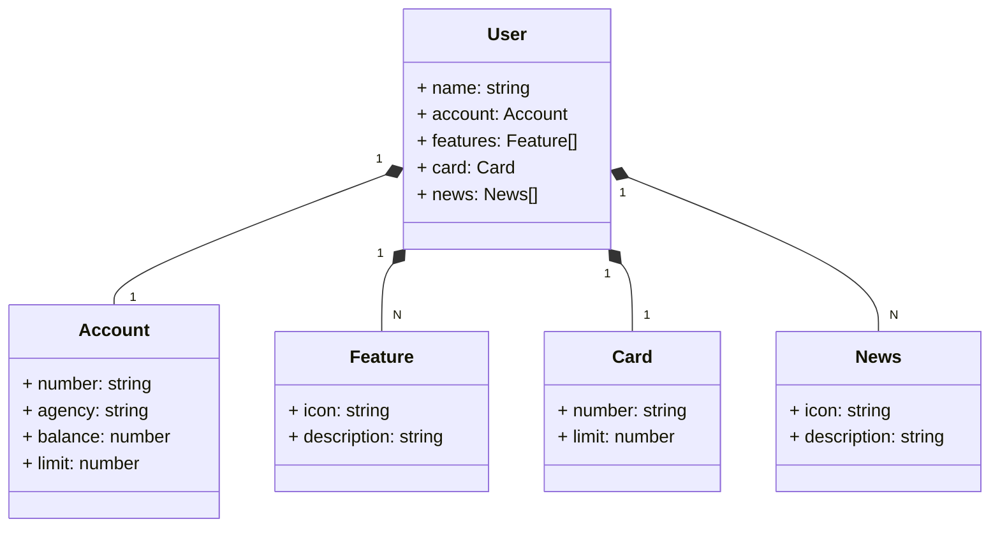

Santander Dev Week - APIs com Java 17, Spring Boot 3 e Railway - Do Zero ao Deploy em Nuvem

## Start do projeto base:

- https://start.spring.io/

## Dependências:

- Spring Web
- Spring Data JPA
- H2 Database
- PostgreSQL Driver
- Lombok

## Objetos da minha aplicação no formato JSON:

```
{
	"name": "Lucas",
	"account": {
		"number": "00000000-0",
		"agency": "0000",
		"balance": 1234.56,
		"limit": 1000.00
	}
	"features": [
		{
			"icon": "URL",
			"description": "Descrição"
		}
	],
	"card": {
		"number": "xxx xxx xxx 000",
		"limit": 1000.00
	},
	"news": [
		{
			"icon": "URL",
			"description": "Descrição"
		}
	]
}
```

## Gerando diagrama de classe Mermaid com chatGPT utilizando JSON:



## Anotações:

- @Entity
- @Id
- @GeneratedValue(strategy = GenerationType.IDENTITY)
- @OneToOne(cascade = CascadeType.ALL)
- @OneToMany(cascade = CascadeType.ALL, fetch = FetchType.EAGER)
- @Column(unique = true)
- @Column(name = "additional_limit", scale = 13, precision = 2)
- @MappedSuperclass
- @Getter
- @Setter
- @Service